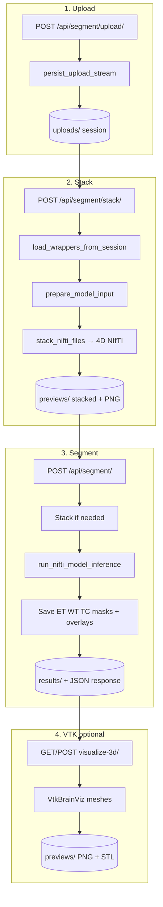

# BraTS Backend — Workflow & Libraries

This document describes how the Django backend processes MRI uploads, stacking, segmentation, and optional 3D VTK visualization.

---

## Tech stack (libraries)

| Library | Role in this project |
|---------|----------------------|
| **Django 5** | Web framework, routing, ORM (`SegmentationJob`, `UploadedFile`) |
| **Django REST Framework** | REST API views, multipart parsing, JSON responses |
| **django-cors-headers** | Allow frontend (Vite) to call the API cross-origin |
| **python-dotenv** | Load `backend/.env` (Supabase keys, `DEBUG`, etc.) |
| **WhiteNoise** | Serve static files in production |
| **NumPy** | Volume arrays, mask math, preview normalization |
| **NiBabel** | Read/write NIfTI (`.nii`, `.nii.gz`), affines, headers |
| **Pillow (PIL)** | PNG previews (stack preview, per-modality upload preview) |
| **TensorFlow / Keras** | Load `model/model.keras` and run inference |
| **SciPy** | Connected-component cleanup on predicted labels (`ndimage`) |
| **Supabase Python client** | Upload/download objects when `USE_SUPABASE_STORAGE=true` |
| **VTK** | Off-screen 3D mesh + PNG export (`visualize-3d` endpoint) |

Full pinned versions: `backend/requirements.txt`.

---

## Project layout (backend)

```
backend/
├── config/                 # settings.py, urls.py, env helpers
├── segmentation/           # Main API app
│   ├── views.py            # HTTP endpoints
│   ├── urls.py             # /api/segment/...
│   ├── upload_workflow.py  # Save uploads, publish to storage
│   ├── stacking.py         # Combine 4 modalities → 4D NIfTI
│   ├── inference_pipeline.py  # prepare_model_input, viewer T2 base
│   ├── inference.py        # model.keras → ET/WT/TC masks
│   ├── vtk_visualization.py   # VTK brain + tumor meshes
│   ├── storage.py          # Local vs Supabase storage
│   ├── model_loader.py     # Singleton Keras model load
│   └── models.py           # SegmentationJob, UploadedFile
├── model/model.keras       # Trained segmentation model (local)
├── media/                  # Local files when Supabase is off
└── tmp/sessions/           # Scratch dir for remote storage mode
```

---

## Storage modes

Controlled by `USE_SUPABASE_STORAGE` in `backend/.env`.

| Mode | Where files live | Public URLs |
|------|------------------|-------------|
| **Local** (`false`) | `backend/media/uploads/`, `previews/`, `results/` | `/media/...` |
| **Supabase** (`true`) | Bucket `brain-mri` (default) | `SUPABASE_PUBLIC_URL/...` |

### Object key layout (Supabase / logical paths)

| Prefix | Contents |
|--------|----------|
| `uploads/{session_id}/{session_id}_{modality}.nii.gz` | T1, T1ce, T2, FLAIR |
| `previews/{session_id}/{job_id}_stacked.nii.gz` | 4-channel stacked volume |
| `previews/{session_id}/{job_id}_viewer_t2.nii.gz` | T2-only 3D base for viewer |
| `previews/{session_id}/stacked_preview.png` | Axial PNG preview |
| `previews/{session_id}/{job_id}_visualization.png` | VTK render snapshot |
| `previews/{session_id}/{job_id}_*_mesh.stl` | VTK exported meshes |
| `results/{session_id}/{job_id}_et_mask.nii.gz` | ET / WT / TC masks, label map, overlay layers |

`session_id` = job UUID. Inference always runs on **local scratch** under `tmp/sessions/{id}/`; results are then uploaded via `publish_artifact()`.

---

## End-to-end workflow



Typical frontend flow: **upload all 4 modalities → stack → segment** (steps 1–3). Step 4 runs when the user opens the **3D Visualization** tab.

---

## 1. Upload method

**Endpoints:** `POST /api/segment/upload/` or `POST /api/upload/`  
**View:** `views.save_uploads`  
**Core module:** `upload_workflow.py`

### What happens

1. Client sends `multipart/form-data` with `files[]`, `modalities[]`, optional `job_id` / `session_id`.
2. Django creates or reuses a `SegmentationJob` (UUID = session).
3. Previous session artifacts may be cleared (`clear_session_artifacts`).
4. Each file is written with `persist_upload_stream()`:
   - **Local:** `media/uploads/{session_id}_{modality}.nii.gz`
   - **Supabase:** scratch file → `uploads/{session_id}/...` via `SupabaseStorage.upload()`
5. Response returns `job_id`, `session_id`, and per-file `url` for the Niivue viewer.

### Libraries used

- **DRF** `MultiPartParser` — parse uploads  
- **NiBabel** — not used at upload time (raw bytes saved)  
- **Supabase client** — optional remote storage  

### Validation

- Extensions: `.nii`, `.nii.gz`, `.png` (`stacking.infer_extension`)
- Four files: must be `t1`, `t1ce`, `t2`, `flair` each once (`validate_upload_combination`)

---

## 2. Stack method

**Endpoints:** `POST /api/segment/stack/` or `POST /api/stack/`  
**View:** `views.stack_preview`  
**Core modules:** `inference_pipeline.py`, `stacking.py`

### What happens

1. Loads uploaded files for `job_id` (`load_wrappers_from_session`) or accepts new multipart files.
2. `prepare_model_input(file_wrappers, job_id)`:
   - Validates four modalities (or single stacked file mode).
   - **`stack_nifti_files()`** — reads each modality with **NiBabel**, aligns to reference affine, stacks along channel axis → shape `(X, Y, Z, 4)`.
   - Saves `{job_id}_stacked.nii.gz` under previews.
3. **`middle_axial_preview_slice()`** — **NumPy** normalization → **Pillow** PNG → base64 in response and `stacked_preview.png`.
4. `publish_artifact()` pushes stacked NIfTI (+ PNG) to Supabase if enabled.
5. Updates `SegmentationJob.stacked_url`.

### Libraries used

| Step | Library |
|------|---------|
| Load each NIfTI | NiBabel |
| Stack channels | NumPy |
| PNG preview | Pillow |
| Persist / URL | `upload_workflow`, `storage` |

### Output

- `stacked_url` — 4-channel NIfTI URL  
- `preview` / `preview_url` — axial PNG for UI  

---

## 3. Segment method (full pipeline)

**Endpoint:** `POST /api/segment/`  
**View:** `views.create_segmentation`  
**Core modules:** `inference_pipeline.py`, `inference.py`, `upload_workflow.py`

### Steps inside `create_segmentation`

| Step | Name | What runs |
|------|------|-----------|
| 1 | **Upload / load** | Save new files or `load_wrappers_from_session` |
| 2 | **Stack** | `prepare_model_input()` → `{job_id}_stacked.nii.gz` |
| 3 | **Viewer base** | `write_viewer_base_nifti()` — extract T2 (channel 2) as 3D NIfTI for mask overlay |
| 4 | **Inference** | `run_nifti_model_inference(stacked_path)` |
| 5 | **Postprocess** | Save masks in parallel (`ThreadPoolExecutor`) |
| 6 | **Respond** | JSON with `overlays`, `metrics`, URLs (no polling required) |

### Inference details (`inference.py`)

1. **NiBabel** loads stacked 4D volume.
2. **TensorFlow/Keras** loads `model.keras` once (`model_loader.get_model()`).
3. Volume normalized and reshaped for model input (`_prepare_for_model`).
4. `model.predict()` → multi-class logits/probabilities.
5. **SciPy** `ndimage` — small component removal on labels.
6. **NumPy** builds BraTS regions:
   - **ET** = class 1 (enhancing tumor)
   - **TC** = ET + NETC + RC
   - **WT** = TC + edema (SNFH)
7. Exclusive overlay layers for multi-mask display (`et_overlay`, `tc_net_overlay`, `wt_ed_overlay`).
8. **NiBabel** saves uint8 NIfTI masks; `publish_artifact()` to `results/{session_id}/`.

### Files written per job

| File | Purpose |
|------|---------|
| `{id}_et_mask.nii.gz` | Enhancing tumor binary mask |
| `{id}_tc_mask.nii.gz` | Tumor core binary mask |
| `{id}_wt_mask.nii.gz` | Whole tumor binary mask |
| `{id}_seg_labels.nii.gz` | Multi-class label map (0–4) |
| `{id}_et_overlay.nii.gz` | Non-overlapping layer for viewer |
| `{id}_tc_net_overlay.nii.gz` | NETC + RC layer |
| `{id}_wt_ed_overlay.nii.gz` | Edema layer |
| `{id}_viewer_t2.nii.gz` | 3D base MRI for Niivue |

### Libraries used

| Step | Library |
|------|---------|
| I/O | NiBabel |
| Model | TensorFlow, Keras |
| Masks / regions | NumPy |
| Cleanup | SciPy |
| DB | Django ORM |
| Storage | LocalStorage / Supabase |

---

## 4. VTK 3D visualization (optional)

**Endpoint:** `GET|POST /api/segment/{job_id}/visualize-3d/`  
**View:** `views.visualize_3d`  
**Core module:** `vtk_visualization.py`

Runs **after** segmentation when the user opens the 3D Visualization tab.

1. Resolves **brain** NIfTI: `t1ce` upload, else `viewer_t2`, else stacked volume.
2. Resolves **mask**: `{job_id}_seg_labels.nii.gz`.
3. **VTK** pipeline:
   - `vtkNIFTIImageReader` — read volumes
   - `vtkFlyingEdges3D` — brain isosurface
   - `vtkDiscreteMarchingCubes` — per-label tumor meshes
   - `vtkDecimatePro`, `vtkSmoothPolyDataFilter`, `vtkPolyDataNormals` — mesh cleanup
   - Off-screen `vtkRenderWindow` → PNG via `vtkWindowToImageFilter`
   - `vtkSTLWriter` — brain + per-label STL files
4. `publish_artifact()` → `previews/{session_id}/`.

Requires: `pip install vtk` (see `requirements.txt`).

---

## API reference (summary)

| Method | URL | Description |
|--------|-----|-------------|
| `GET` | `/api/health/` | Backend OK; `?model=1` tests Keras load |
| `POST` | `/api/segment/upload/` | Save modality files |
| `POST` | `/api/segment/view-uploads/` | Per-file axial PNG previews (before stack) |
| `POST` | `/api/segment/stack/` | Stack → `stacked_url` + PNG preview |
| `POST` | `/api/segment/` | Upload + stack + infer + save masks (all-in-one) |
| `GET` | `/api/segment/{id}/status/` | Job status / progress |
| `GET` | `/api/segment/{id}/result/` | Full result + overlay URLs |
| `GET` | `/api/segment/{id}/download/` | Download WT mask NIfTI |
| `GET`/`POST` | `/api/segment/{id}/visualize-3d/` | VTK PNG + STL meshes |

All routes are mounted under `/api/` in `config/urls.py`.

---

## Environment variables (backend `.env`)

| Variable | Purpose |
|----------|---------|
| `DJANGO_SECRET_KEY` | Django secret |
| `DEBUG` | Debug mode |
| `ALLOWED_HOSTS` | Host allowlist |
| `FRONTEND_URL` | CORS origins |
| `USE_SUPABASE_STORAGE` | `true` → Supabase bucket |
| `SUPABASE_URL` | Supabase project URL |
| `SUPABASE_SERVICE_ROLE_KEY` | Storage upload key |
| `SUPABASE_BUCKET` | Default `brain-mri` |
| `SUPABASE_PUBLIC_URL` | Public CDN base for file URLs |
| `MODEL_KERAS_PATH` | Optional override for `model.keras` |
| `TEMP_MEDIA_ROOT` | Scratch directory for remote mode |

---

## Database models

- **`SegmentationJob`** — UUID job id, status, `stacked_url`, `mask_url`, `metrics`, progress fields.
- **`UploadedFile`** — optional `FileField` copies when using local storage (not used for every artifact in Supabase mode).

SQLite is used by default in development (`db.sqlite3`).

---

## Running the backend

```bash
cd backend
python -m venv .venv
# Windows: .venv\Scripts\activate
pip install -r requirements.txt
python manage.py migrate
python manage.py runserver
```

API base: **http://127.0.0.1:8000/api/**

For VTK 3D tab, ensure VTK installed: `pip install "vtk>=9.3,<10.0"`.
